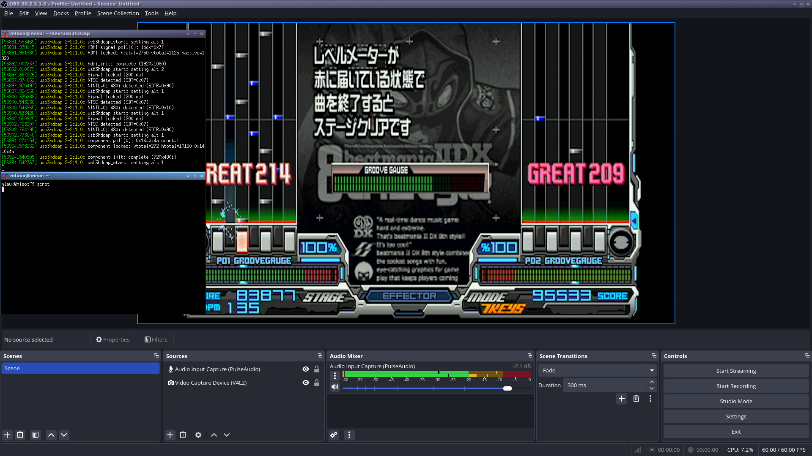

# StarTech USB3HDCAP Linux Driver



This is a Linux driver for the StarTech USB3HDCAP USB 3.0 HD Video Capture
Device, developed based on USBPcap analysis of the device and reverse
engineering of `CY3014.X64.SYS`.

The driver registers as a V4L2 device for video and an ALSA device for audio. 
Supports V4L2 controls for brightness, contrast, saturation, hue, and sharpness
when using the composite and S-Video inputs. 

Interlaced modes are delivered as `V4L2_FIELD_ALTERNATE` with top/bottom fields
as separate buffers because that's the closest to what the actual hardware
provides, I've noticed that some user mode software doesn't support this
properly - if you run into an issue where the image is squished vertically,
just manually stretch it back to the correct aspect ratio.

### Inputs I've tested

* Composite: 240p, 288p, 480i, 576i
* S-Video: 240p, 288p, 480i, 576i
* Component: 240p, 288p, 480i, 480p, 576i, 576p, 720p, 1080i
* HDMI: 1080p60

### Inputs that will probably also work

* HDMI: 640x480p, 720x480p, 720x576p, 720p50, 720p60, 1080p30, 1080p50, 1080p60

### Building

```
# Debian
apt install linux-headers
make
```

### Hardware overview

* CYUSB3014 EZ-USB FX3
* MST3367 HDMI receiver/component ADC/scaler
* TW9900 composite/YC decoder,
* CS53L21 audio ADC
* Altera MAX II CPLD for input switching
* XCAPTURE-1 variant also has a Nuvoton NUC100 MCU that intercepts I2C traffic
  for some reason
* Requires USB 3.0, this device uses iso transfers with burst and "mult"

### Limitations

* DVI and VGA inputs not supported
* V4L2 controls should be disabled on non-tw9900 inputs
* Other video modes will probably "just work" if the appropriate entries are
  added in the mode tables and code is added to disambiguate using htotal if
  necessary
* HDMI color space correction produces incorrect colors with some sources, I
  have the data from the Windows packet captures to fix this but haven't yet
* XCAPTURE-1 HDMI and component are not usable / untested
* No HDCP support

## Thanks

* [stoth68000](https://github.com/stoth68000) for [hdcapm](https://github.com/stoth68000/hdcapm)
* Driver structure heavily based on the `usbtv` driver
* [rm-iso](https://github.com/rm-iso) for encouraging me to write this

## License

GPL2
